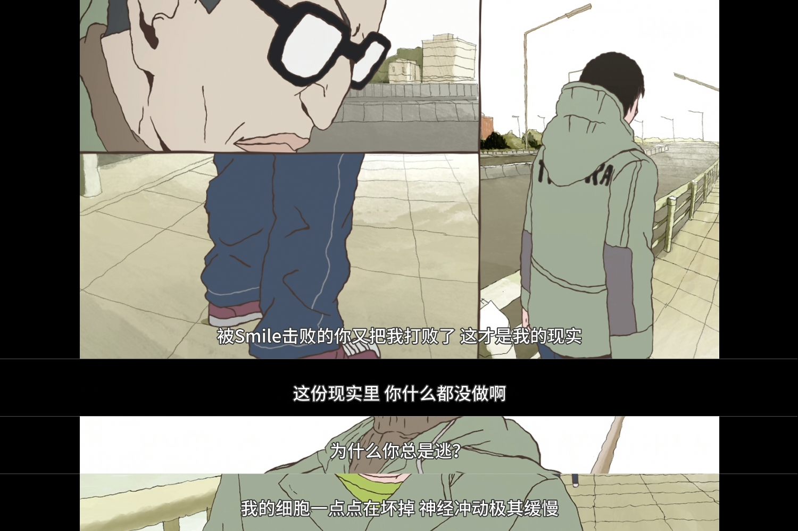
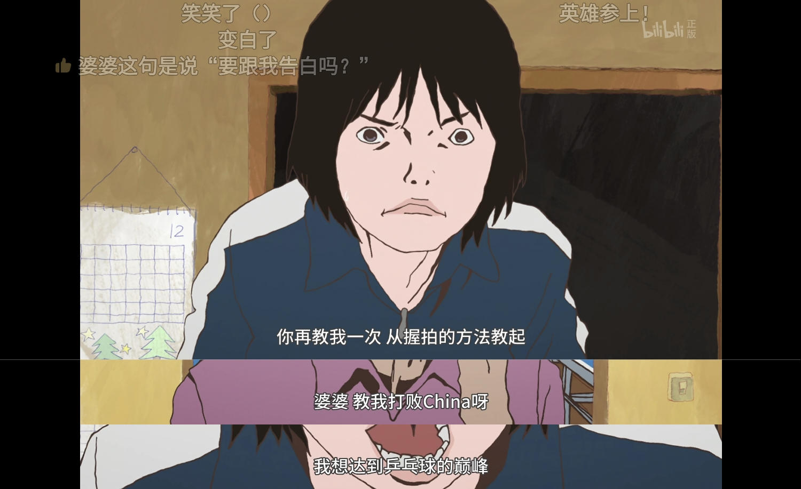

# YesLiu's Blog
我很喜欢汤浅政明的动画《乒乓》，以其中主角Peko的经历，作为自己博客的主题。

欢迎来到我的博客，我是一名野球手，在广阔的互联网世界里与人切磋，提高球技

## 自我介绍

### 野球打多了，是会把自己打废了的
我曾经是一名野球手，我喜欢取胜的快感
我从来没想过会有人比我厉害，闭上眼睛挥舞球拍，球也会自己跑过来
我能在天上飞，能轻松摸到月亮再回来
我根本不知道什么叫奇迹

有一天我被曾经的手下败将打了个落花流水，我谁也打不过了，我不再打球了

### 可是一味逃跑永远不会前进啊
所以我决定重新开始打球，从握拍学起，就像我还不会打球时那样

